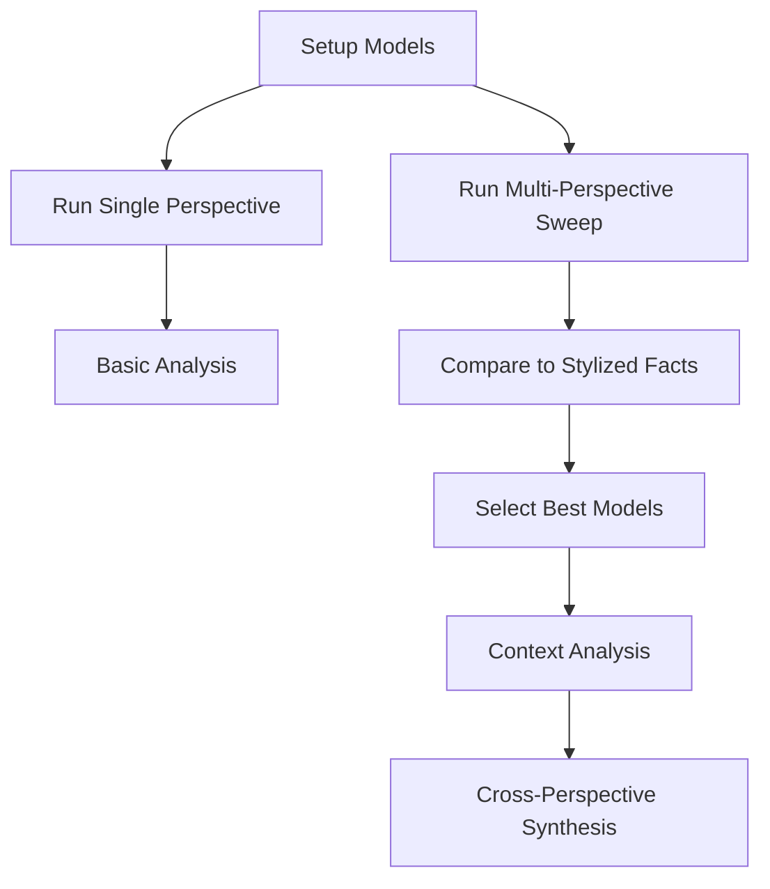

# Analysis Pipeline

This document outlines the complete workflow for running simulations and analyzing leadership emergence patterns across different theoretical perspectives.

## Overview



## 1. Basic Simulation Workflow

### Setup and Run Single Perspective
```python
from src.models.perspectives.interactionist import InteractionistModel
from src.models.perspectives.cognitive import CognitiveModel

# Create model for specific perspective
model = InteractionistModel(
    n_agents=4,
    claim_multiplier=0.7,
    grant_multiplier=0.6
)

# Run simulation
history = []
for _ in range(100):
    state = model.step()
    history.append(state)  # Store for time series analysis
```

### Using Command Line
```bash
# Run a single perspective simulation
python scripts/run_simulation.py \
    --perspective interactionist \
    --n-agents 4 \
    --n-steps 100 \
    --output-dir outputs/single_run
```

## 2. Multi-Perspective Parameter Sweep

### Basic Multi-Perspective Sweep
```bash
# Run parameter sweep across perspectives
python scripts/parameter_sweep.py \
    --perspectives interactionist cognitive identity \
    --n-agents 4 6 8 \
    --claim-multiplier 0.5 0.7 0.9 \
    --grant-multiplier 0.4 0.6 0.8 \
    --n-steps 100 \
    --n-replications 5
```

### With Context
```bash
# Run with crisis context
python scripts/parameter_sweep.py \
    --perspectives interactionist cognitive \
    --context crisis \
    --context-params intensity=0.7 \
    --n-agents 4 6 8
```

## 3. Stylized Facts Analysis

### Define Stylized Facts
```python
stylized_facts = {
    "time_to_first_leader": {
        "target": 20,
        "weight": 1.0
    },
    "num_leaders": {
        "target": 1,
        "weight": 0.8
    },
    "leadership_concentration": {
        "target": 0.7,
        "weight": 0.6
    }
}
```

### Compare to Stylized Facts
```bash
# Analyze fit to stylized facts
python scripts/analyze_stylized_facts.py \
    --results-dir outputs/parameter_sweep \
    --stylized-facts stylized_facts.json \
    --output-dir outputs/analysis/stylized_facts
```

## 4. Best Model Selection

### Select Best Parameters
```bash
# Find best parameter sets per perspective
python scripts/select_best_models.py \
    --analysis-dir outputs/analysis/stylized_facts \
    --output-dir outputs/best_models \
    --top-n 3  # Store top 3 parameter sets per perspective
```

## 5. Context Analysis

### Run Best Models in Different Contexts
```bash
# Test best models in crisis context
python scripts/run_context_analysis.py \
    --best-models outputs/best_models \
    --contexts crisis resource_scarcity \
    --n-replications 10
```

## 6. Cross-Perspective Synthesis

### Compare Perspectives
```bash
# Generate comparative analysis
python scripts/compare_perspectives.py \
    --best-models outputs/best_models \
    --context-results outputs/context_analysis \
    --output-dir outputs/synthesis
```

## 7. Output Structure

```
outputs/
├── parameter_sweep/
│   ├── results_TIMESTAMP.json    # Raw simulation data with perspective tags
│   └── summary_TIMESTAMP.csv     # Statistical summary
├── analysis/
│   ├── stylized_facts/          # Comparison to stylized facts
│   │   ├── distances.csv        # Distance metrics
│   │   └── rankings.csv         # Parameter set rankings
│   └── figures/                 # Generated plots
├── best_models/
│   ├── interactionist/          # Best parameters per perspective
│   ├── cognitive/
│   └── identity/
├── context_analysis/            # Results of context testing
│   ├── crisis/
│   └── resource_scarcity/
└── synthesis/                   # Cross-perspective analysis
    ├── comparative_metrics.csv
    ├── context_effects.csv
    └── figures/
```

## 8. Key Metrics

### Leadership Emergence (Stylized Facts)
- Time to first leader (score > 75)
- Number of leaders at end
- Leadership score distribution
- Leadership concentration (Gini coefficient)

### Interaction Dynamics
- Claim frequency
- Grant success rate
- Leadership stability
- Time series patterns

### Context Effects
- Change in emergence speed
- Stability under perturbation
- Adaptation patterns

## 9. Best Practices

### Data Management
- Tag all results with perspective and context
- Store complete parameter sets
- Save time series data for key metrics
- Use consistent naming conventions

### Analysis
- Run multiple replications
- Check for convergence
- Validate against stylized facts
- Document parameter choices
- Compare across perspectives

### Development
- Write tests for each perspective
- Document theoretical basis
- Update pipeline documentation
- Version control results
 