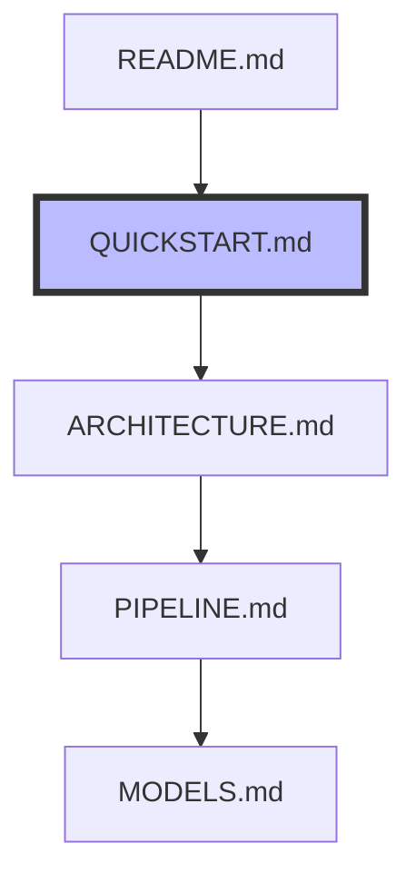

# Quick Start Guide

## Setup (5 minutes)

1. **Clone the repository**
   ```bash
   git clone https://github.com/bacton/abm-lead-emergence.git
   cd abm-lead-emergence
   ```

2. **Create a virtual environment**
   ```bash
   python -m venv venv
   source venv/bin/activate  # On Windows: venv\Scripts\activate
   pip install -r requirements.txt
   ```

## Running Your First Simulation (2 minutes)

1. **Run a basic simulation**
   ```bash
   python scripts/run_simulation.py
   ```

2. **View the results**
   - Check `outputs/` for visualizations
   - See `results/base_model_results.md` for analysis

## Trying Different Parameters (3 minutes)

1. **Edit settings in `config/base.yaml`**
   ```yaml
   n_agents: 5              # Number of agents
   success_boost: 6.992     # How much success helps
   failure_penalty: 2.299   # How much failure hurts
   ```

2. **Run with new settings**
   ```bash
   python scripts/run_simulation.py --config config/base.yaml
   ```

## Next Steps

- Read [Model Documentation](MODELS.md) to understand how it works
- Check [Development Status](ROADMAP.md) to see what's next
- Try the [Analysis Pipeline](PIPELINE.md) for deeper insights

## 3. Run Parameter Sweep (10 minutes)
```bash
# Run a basic parameter sweep
python scripts/parameter_sweep.py \
    --perspective interactionist \
    --n-agents 4 6 \
    --n-steps 100 \
    --n-replications 3
```

## Common Issues

1. **ImportError**: Make sure you're in the project root and virtual environment is activated
2. **Parameter Error**: Check parameter ranges in `src/config/parameters.py`
3. **Output Error**: Ensure `outputs/` directory exists

## 🔄 Next Steps

Now that you've run your first simulation, you should:

1. → Read [ARCHITECTURE.md](ARCHITECTURE.md) to understand the technical design
   - Learn about the base model
   - See how perspectives are implemented
   - Understand the context system

2. → Then follow [PIPELINE.md](PIPELINE.md) to run complete analyses
   - Run parameter sweeps
   - Compare to stylized facts
   - Test different contexts

3. → Finally, check [MODELS.md](MODELS.md) for theoretical background
   - Learn about each perspective
   - Understand model assumptions
   - See implementation details

📍 **You are here**:
