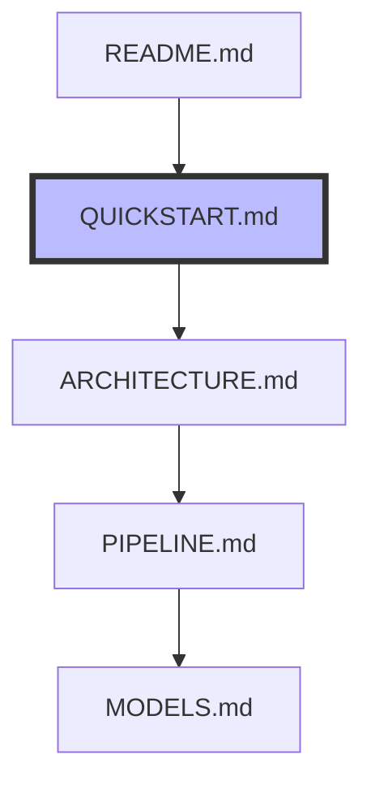

# Quick Start Guide

This guide will help you get started with the Leadership Emergence ABM framework. For a complete technical overview, see [ARCHITECTURE.md](ARCHITECTURE.md).

## 1. Basic Setup (5 minutes)
```bash
# Clone and setup environment
git clone https://github.com/bacton/abm-lead-emergence.git
cd abm-lead-emergence
python -m venv venv
source venv/bin/activate  # On Windows: venv\Scripts\activate
pip install -r requirements.txt
```

## 2. Run Your First Simulation (2 minutes)
```python
from src.models.perspectives.interactionist import InteractionistModel

# Create and run a basic simulation
model = InteractionistModel(n_agents=4)
for _ in range(100):
    state = model.step()
print(f"Number of leaders: {state['metrics']['num_leaders']}")
```

## 3. Run Parameter Sweep (10 minutes)
```bash
# Run a basic parameter sweep
python scripts/parameter_sweep.py \
    --perspective interactionist \
    --n-agents 4 6 \
    --n-steps 100 \
    --n-replications 3
```

## Next Steps

### If you want to...

1. **Understand the Code Structure**
   → Check [ARCHITECTURE.md](ARCHITECTURE.md)

2. **Run Complete Analysis**
   → Follow [PIPELINE.md](PIPELINE.md)

3. **Learn About Models**
   → Read [MODELS.md](MODELS.md)

4. **See Development Status**
   → View [ROADMAP.md](ROADMAP.md)

### Common Tasks

1. **Add a New Perspective**
   ```python
   # src/models/perspectives/your_perspective.py
   class YourPerspectiveModel(BaseLeadershipModel):
       def _process_claims_and_grants(self, interactions):
           # Your perspective-specific logic here
           pass
   ```

2. **Add a New Context**
   ```python
   # src/simulation/contexts/your_context.py
   class YourContext(Context):
       def modify_claim_probability(self, base_prob: float) -> float:
           # Your context-specific modification here
           return modified_prob
   ```

3. **Analyze Results**
   ```python
   # Load and analyze results
   import pandas as pd
   results = pd.read_csv('outputs/parameter_sweep/summary_latest.csv')
   best_models = select_best_models(results)
   ```

## Common Issues

1. **ImportError**: Make sure you're in the project root and virtual environment is activated
2. **Parameter Error**: Check parameter ranges in `src/config/parameters.py`
3. **Output Error**: Ensure `outputs/` directory exists

## 🔄 Next Steps

Now that you've run your first simulation, you should:

1. → Read [ARCHITECTURE.md](ARCHITECTURE.md) to understand the technical design
   - Learn about the base model
   - See how perspectives are implemented
   - Understand the context system

2. → Then follow [PIPELINE.md](PIPELINE.md) to run complete analyses
   - Run parameter sweeps
   - Compare to stylized facts
   - Test different contexts

3. → Finally, check [MODELS.md](MODELS.md) for theoretical background
   - Learn about each perspective
   - Understand model assumptions
   - See implementation details

📍 **You are here**:
